# Codex Quota Mini

把 Codex 剩余额度收进一个 44 px 悬浮沙漏。圆环看本周额度，沙量看 5 小时额度；悬停查看详情，点击运行中的会话即可返回对话。

**当前版本：0.8.7 · 非 OpenAI 官方插件 · 本地运行**

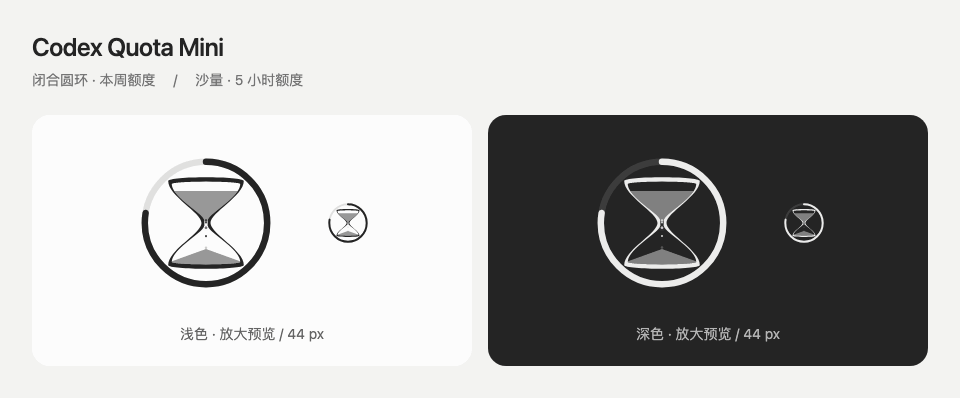

*当前版本的浅色 / 深色动效，每组包含放大图与 44 px 实际尺寸。所有额度、速度和会话均为演示数据。*

[安装和启动](#安装和启动) · [功能图解](#功能图解) · [数据和限制](#数据和限制)

## 功能

- 闭合圆环表示本周剩余额度，沙漏中的沙量表示 5 小时剩余额度。
- 有本地会话运行时落沙；估算的 token 消耗速度与模型权重影响动效。
- 悬停查看额度、重置时间和运行中的会话；点击会话标题跳转。
- 拖动调整位置，可选择全局显示或仅在 Codex 前台显示。
- 跟随 Codex 的浅色、深色或系统外观设置。
- 确认 5 小时额度重置时，内部沙漏翻转一次。
- 额度耗尽时变暗并显示重置倒计时，周额度优先于 5 小时额度。
- 调试面板提供流量、闪耀程度和六种落沙方案；细砂方案通过粗细与密度表现流量。

它是独立悬浮窗，不是 Codex 迷你窗口中的嵌入控件。

## 运行要求

- macOS 13 或更高版本。
- 已安装并登录 Codex 桌面应用。
- Apple Command Line Tools，提供 Swift 编译器和代码签名工具。
- 系统 `/usr/bin/python3` 可用；启动和开发脚本也需要 `python3`。
- Node.js 22 或更高版本，用于本地 MCP 设置服务。

首次启动在本机从源码编译。仓库包含已构建的设置服务，普通安装无需安装 npm 依赖。应用不会注册开机启动。

## 安装和启动

### 从 GitHub 安装

确认满足上面的运行要求。如果尚未安装 Apple Command Line Tools，先运行并完成安装：

```sh
xcode-select --install
```

在终端注册 GitHub 插件市场并安装：

```sh
codex plugin marketplace add yfwu2020/codex-quota-mini --ref main
codex plugin add codex-quota-mini@quota-mini-local
```

安装后，在 Codex 对话中输入：**启动 Codex Quota Mini**。插件会从安装目录编译并启动悬浮圆。

### 日常使用

打开 Codex 的插件设置，搜索 **Codex Quota Mini**，即可使用“显示悬浮圆”“全局显示”和调试设置。

- **查看详情**：将指针停在悬浮圆上，查看剩余额度、重置时间和运行中的会话。
- **返回对话**：点击详情中的会话标题。
- **调整位置**：拖动悬浮圆；关闭全局显示后，仅在 Codex 前台显示。
- **调试或退出**：右键悬浮圆，打开调试面板或退出应用。

关闭“显示悬浮圆”只隐藏窗口，右键退出则结束应用和帮助程序。

### 从源码安装和手动控制

如果希望查看源码或直接通过脚本启动，克隆仓库并进入根目录：

```sh
git clone https://github.com/yfwu2020/codex-quota-mini.git
cd codex-quota-mini
codex plugin marketplace add .
codex plugin add codex-quota-mini@quota-mini-local
python3 plugins/codex-quota-mini/scripts/launch.py start
```

以下命令在克隆的仓库根目录中运行：

```sh
python3 plugins/codex-quota-mini/scripts/launch.py start
python3 plugins/codex-quota-mini/scripts/launch.py stop
python3 plugins/codex-quota-mini/scripts/launch.py status
```

`status` 会输出当前的本地状态，可能包含运行中会话的标题；分享输出前请自行检查。

## 功能图解

原有配图使用 0.8.5 的沙漏绘制代码，耗尽倒计时配图使用 0.8.7 的代码，均以示例数据生成。设置项、显示范围、拖动和跳转目标的示意部分均在图内标明；不包含真实账户额度或聊天内容。

### 圆环和沙量：两个额度窗口

外圈深色部分表示本周剩余额度，闭合的淡色底环始终保留；上半部沙量表示 5 小时剩余额度。读取失败时显示未知状态。

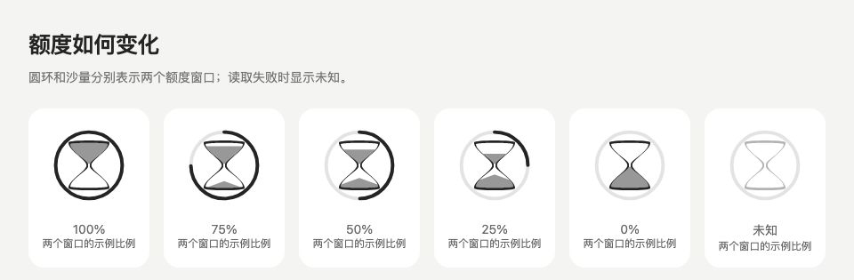

### 额度耗尽与重置倒计时

仅 5 小时额度耗尽时，沙漏变暗，圆环保持亮度；周额度耗尽时，整个悬浮圆变暗。圆心显示每秒更新的倒计时，两者均耗尽时优先显示周额度的重置时间。大于一天显示天与小时，其余显示时／分或分／秒。未知额度不会显示为耗尽；缺少重置时间时显示「时间未知」，倒计时归零后显示「待更新」，待真实额度恢复后再恢复亮度。耗尽时停止自动落沙，调试演示仍可使用。

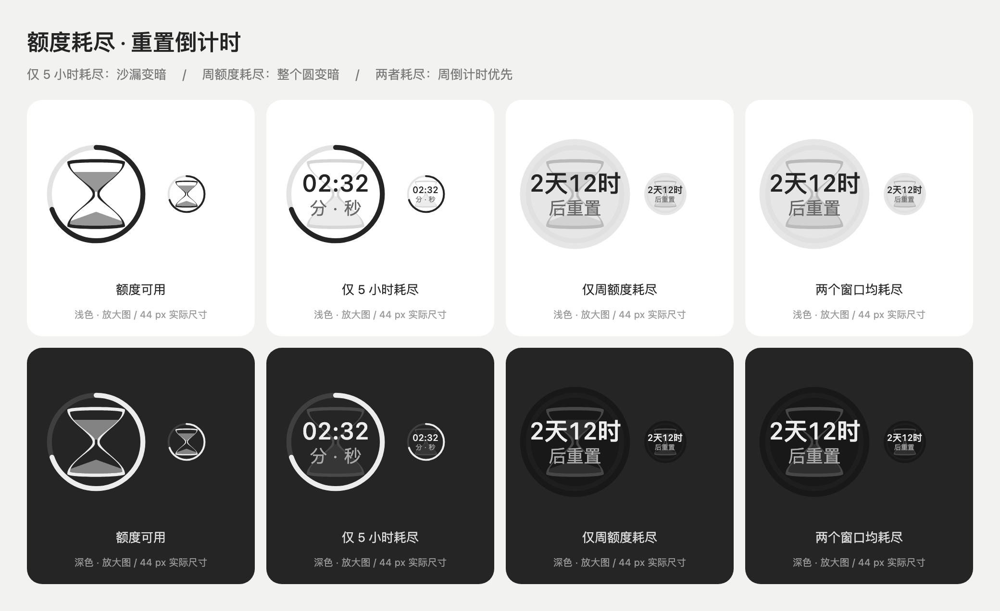

### 悬停详情与会话跳转

指针停在悬浮圆上即可展开详情，圆形图标轻微缩放并改变明暗。详情显示两个额度窗口的百分比、重置时间，以及运行中的本机会话；点击会话标题会打开对应的 Codex 对话。图中右侧卡片用于说明跳转目标。

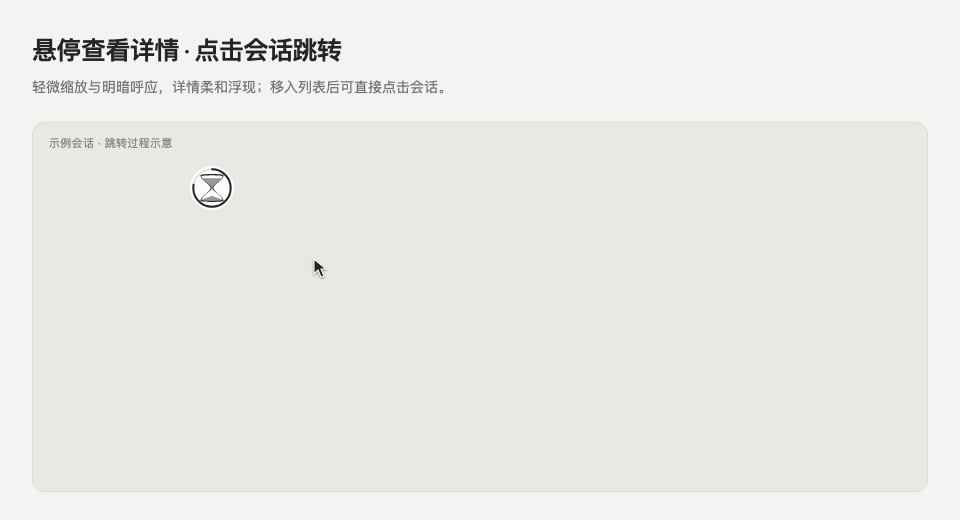

### 浅色、深色与系统外观

悬浮圆和详情一起跟随 Codex 的外观设置；Codex 选择系统外观时，插件也随系统变化。

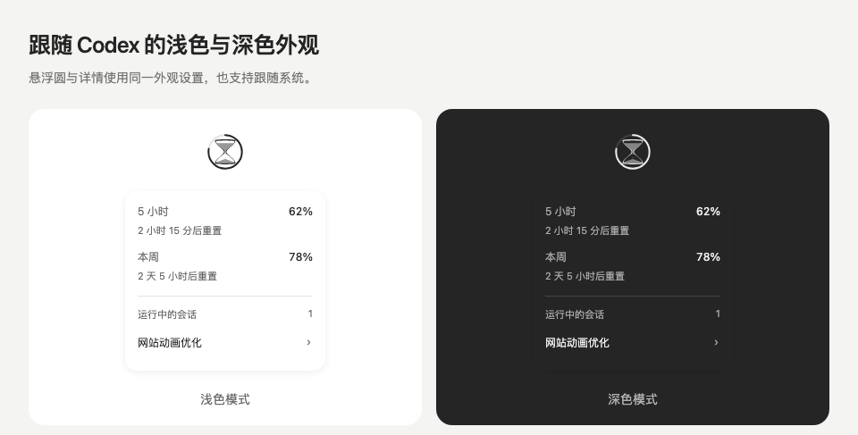

### 拖动位置与自适应详情

拖动悬浮圆即可调整位置。详情根据当前屏幕的可用空间，向上、下、左或右展开，尽量贴近悬浮圆。布局图的坐标由实际原生布局函数计算。

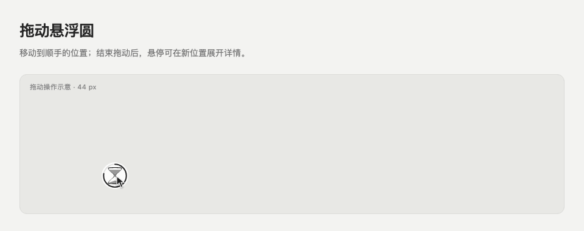

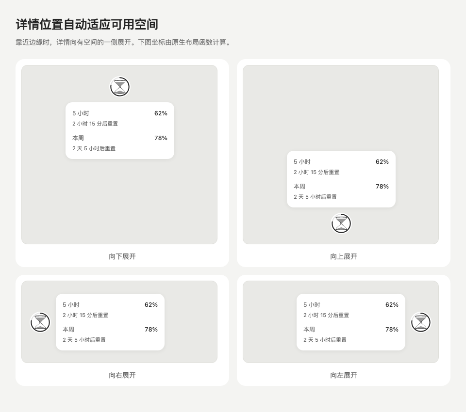

### 显示开关、全局显示和模型系数

在 Codex 的插件设置中搜索 **Codex Quota Mini**。可以控制悬浮圆是否显示、是否在所有应用中显示，以及默认模型系数和调试参数。下面是从插件设置接口生成的设置项示意，具体控件外观由 Codex 决定。

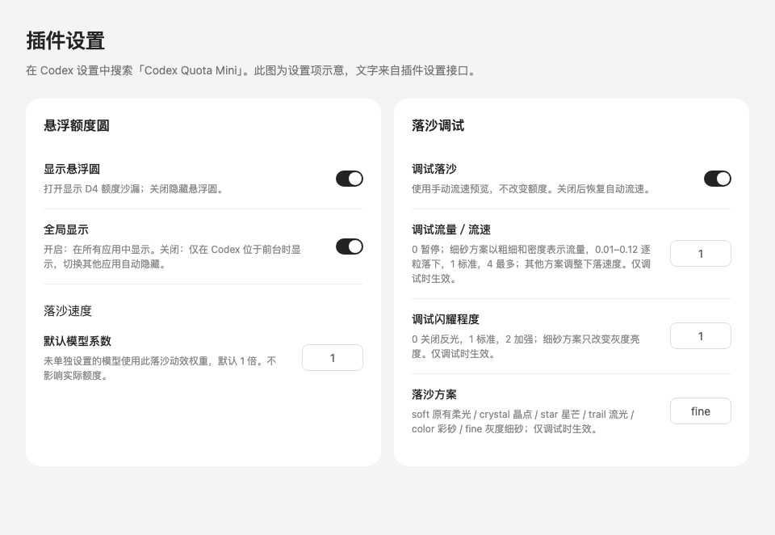

开启全局显示后，悬浮圆在其他应用和桌面中继续显示；关闭后，仅在 Codex 位于前台且窗口可见时显示。关闭“显示悬浮圆”可直接隐藏它。

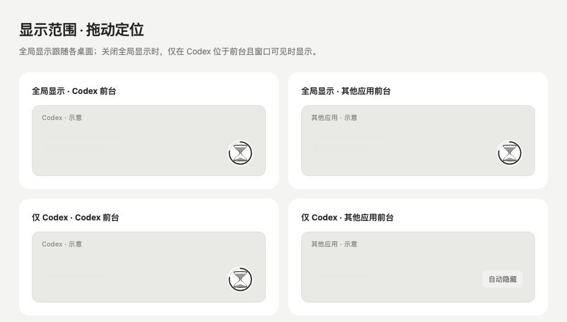

### 会话状态、token 速度与落沙

有本地会话运行时落沙，没有会话时停止。自动下落速度随近期 token 消耗速度和模型系数平滑变化；模型系数可通过价格快照工具赋值，也可以手动调整。它们只影响动效，不改变真实额度。

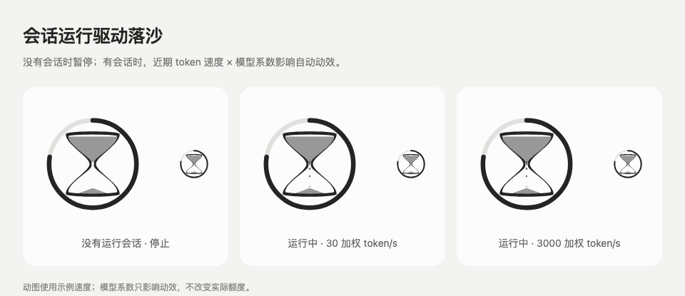

### 5 小时额度重置翻转

确认进入新的 5 小时额度窗口时，内部沙漏翻转一次，恢复新的沙量；外层周额度圆环保持原位。动图中的重置是模拟事件。

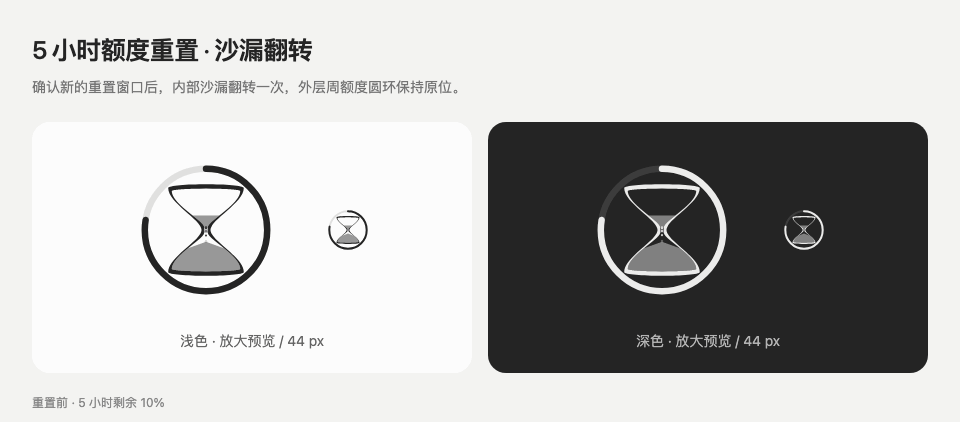

### 调试面板与六种落沙方案

右键悬浮圆，选择 **调试落沙…**。原生面板提供流量 / 流速、闪耀 / 透光程度、方案选择和恢复默认；关闭面板后恢复自动落沙。

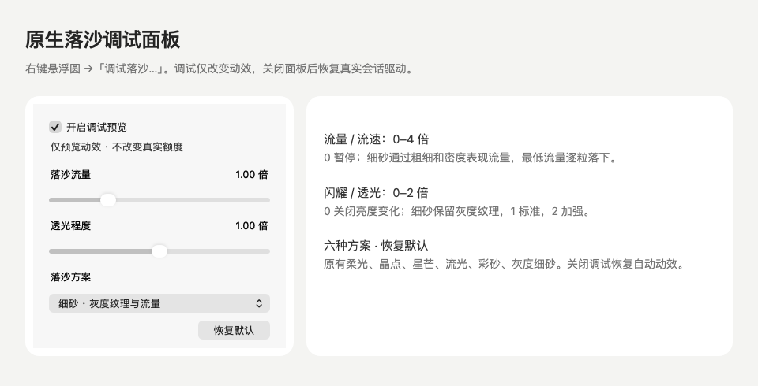

[查看原生面板原图](docs/images/debug-panel-native.png)

六种方案分别为原有柔光、晶点、星芒、流光、彩砂和灰度细砂。方案选择只在调试时生效。

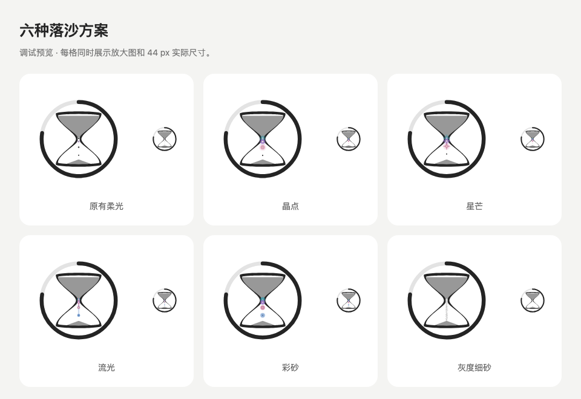

### 细砂流量：从逐粒到细砂线

灰度细砂通过线条粗细和密度表达流量，中心凝实、边缘稀疏。0.01–0.12 倍时逐粒落下，0 表示暂停；提高流量时沙线更粗、更密，下落速度基本保持一致。其他调试方案调整的是下落速度。

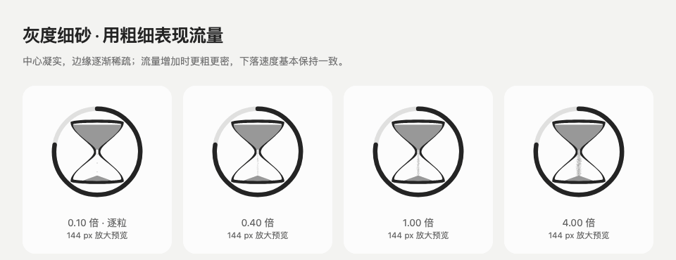

### 闪耀与透光程度

细砂方案只通过灰度亮度表现透光，保持沙漏和沙堆的平面外观。0 关闭亮度变化，1 为标准，2 为加强；其他方案可使用彩色反光。

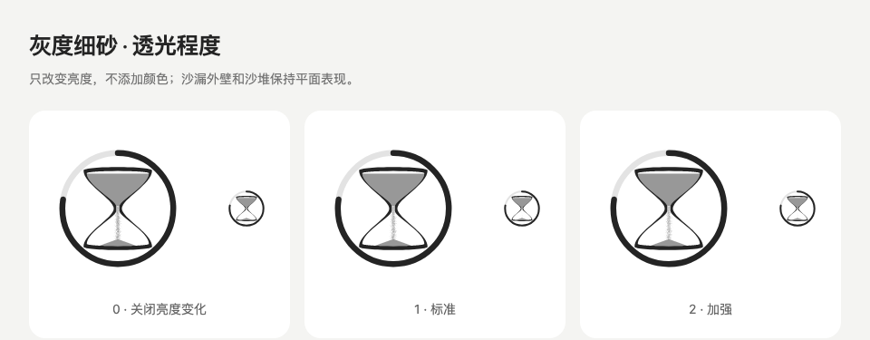

### 交互演示页面

克隆仓库后，在浏览器中打开 [演示页面](plugins/codex-quota-mini/ui/preview.html)，可操作示例额度、会话状态、自动落沙速度、耗尽状态和重置翻转。演示不会消耗真实额度或兑换额度重置。

文档配图的生成方式见 [开发说明](docs/DEVELOPMENT.md#文档配图)。

## 数据和限制

额度通过 Codex app-server 的只读账户及额度接口获取，约每 30 秒刷新，并响应额度更新通知。会话活动与 token 累计计数约每 2 秒从本机数据库的元数据读取；主题设置约每 0.5 秒检查一次。插件不会读取聊天消息正文，不会发送推理请求，也不会调用额度重置兑换。

本机状态和设置保存在 `~/Library/Application Support/Codex Quota Mini/`；这些文件不在仓库中。详见 [数据处理说明](docs/DATA_HANDLING.md)。

会话列表覆盖本地桌面会话，不包含未连接的远程或云端会话。Codex 的本地数据库结构变化可能使活动信息不可用；此时显示未知状态并停止自动落沙。

沙量和圆环以接口返回的额度为准。落沙速度是估算，不等于实时账单或官方订阅额度倍率。API 价格快照属于静态参考数据，仓库不会自动创建价格更新任务。

## 文件结构

```text
.agents/plugins/marketplace.json    本地／Git 插件市场入口
plugins/codex-quota-mini/
  plugin.json                     通用插件清单
  .codex-plugin/plugin.json        Codex 插件清单
  mcp.json                        本地设置服务入口
  native/                         macOS 悬浮窗和调试窗
  ui/                             圆环、沙漏、落沙与演示
  runtime/                        额度、活动、token、主题读取
  runtime/vendor/                 Tomli 及其许可证
  server/                         MCP 设置服务源码与构建文件
  scripts/                        编译、启动与价格权重工具
  skills/                         Codex 使用说明
  assets/                         图标与 API 价格快照
  tests/                          后端、界面、协议与原生检查
  docs/                           历史示例截图
docs/                             文件清单、开发和发布说明
  images/                         当前版本的功能配图与动图
scripts/                          仓库检查与发行包生成
.github/workflows/                自动检查配置
```

详细文件清单见 [FILES.md](docs/FILES.md)，历史版本说明见 [CHANGELOG.md](docs/CHANGELOG.md)，本次验证结果见 [VERIFICATION.md](docs/VERIFICATION.md)。

## 开发和发行

```sh
npm ci
npm --prefix plugins/codex-quota-mini/server ci
npx playwright install chromium
npm run build
npm test
npm run test:browser
npm run check
npm run package
```

原生窗口测试需在 macOS 上运行；详见 [开发说明](docs/DEVELOPMENT.md)。发行包输出到忽略版本控制的 `dist/`。

GitHub 发布前的账号、许可证和说明事项见 [发布准备](docs/PUBLISHING.md)。仓库地址为 https://github.com/yfwu2020/codex-quota-mini；GitHub 分发不表示上架 OpenAI 官方插件目录。

## 许可证

项目采用 [MIT 许可证](LICENSE)，允许修改、分发和商用，需保留版权与许可声明。第三方组件保留各自的许可证，详见 [第三方声明](docs/THIRD_PARTY_NOTICES.md)。
